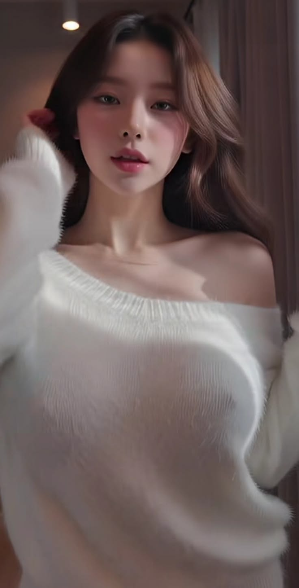
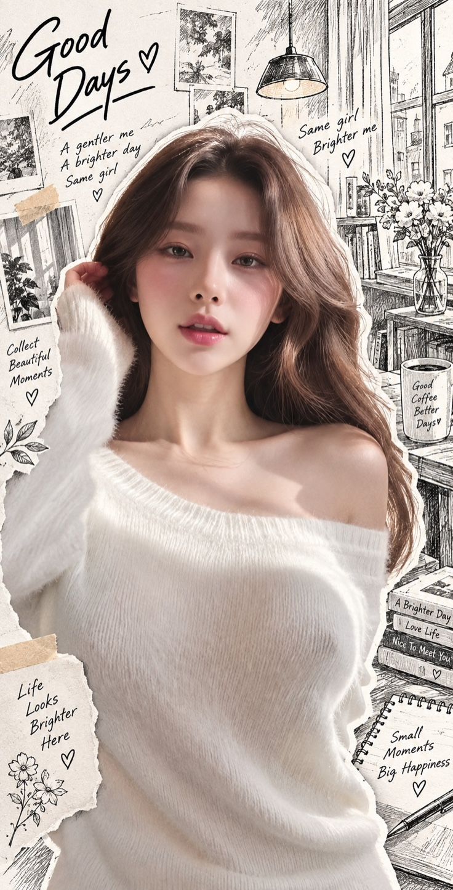

# Silas-真实摄影 × 黑白手绘线稿 × 剪纸拼贴

将原始照片转换为「真实摄影 × 黑白钢笔速写 × 白色剪纸拼贴」混合媒介作品，保留主体身份、数量、动作、空间关系和构图。

## 作品案例

<table>
  <tr>
    <th width="50%">原图</th>
    <th width="50%">成品</th>
  </tr>
  <tr>
    <td><a href="assets/examples/portrait-before.jpg"></a></td>
    <td><a href="assets/examples/portrait-after.jpg"></a></td>
  </tr>
</table>

本例保留人物的彩色摄影质感、服装与抬手姿态，将背景重绘为黑白钢笔速写，并加入白色剪纸边及手写文字。点击图片可查看大图。

## 使用

将本仓库作为一个完整 Skill 文件夹安装到支持 SKILL.md 的工具中。使用时上传原始照片并输入：

```text
使用 $silas-photo-ink-collage，将这张照片制作成真实摄影 × 黑白手绘线稿 × 剪纸拼贴作品。
```

需要具备参考图编辑能力的图像生成工具。Skill 本身不包含模型或 API 密钥。

## 风格与工作流

- 保留重要主体的真实摄影质感与自然色彩。
- 将次要环境转为黑白钢笔速写，保留正确透视。
- 主要主体边缘添加约 1%～2% 的自然白色剪纸边。
- 黑白线稿约 65%～80%，彩色约 20%～35%；主体与构图优先于比例。
- 识别原图 → 读取完整提示词 → 生成 → 对照检查。

## 文件

- [SKILL.md](SKILL.md)：触发规则与执行流程。
- [references/original-prompt.md](references/original-prompt.md)：完整原始提示词。
- [agents/openai.yaml](agents/openai.yaml)：显示名称与默认调用语。
- [assets/icon.svg](assets/icon.svg)：技能图标。

不同图像模型的身份保持与线稿效果可能不同，需要按实际成图检查。

## 许可

本仓库的 Skill 文本与配置采用 [MIT License](LICENSE)。用户输入照片及生成结果的权利不由本许可授予。
